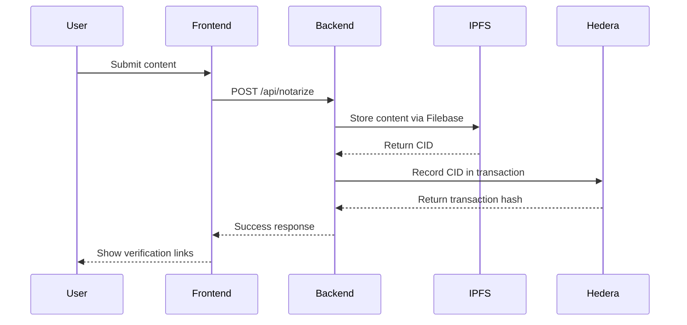
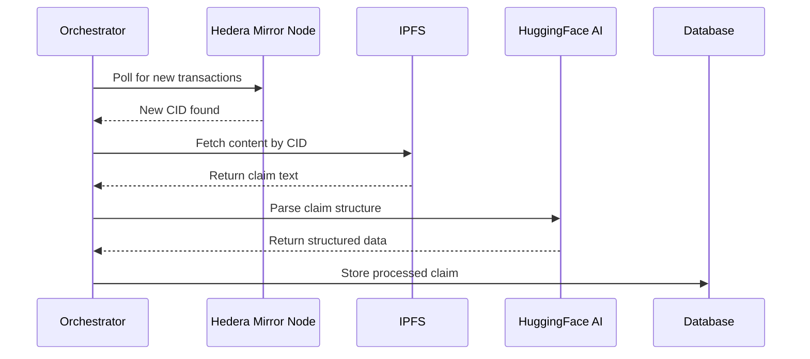

# 🚀 Hedera Content Notarization Platform v2.0

A comprehensive decentralized content notarization system that combines **IPFS storage**, **Hedera blockchain** timestamping, and **AI-powered claim verification** to create legally-admissible proof of content ownership and existence.


## 🌟 What's New in v2.0

- 🏗️ **Reorganized Architecture**: Clean, scalable monorepo structure
- 🤖 **Phase 2 AI Integration**: Real-time claim parsing with HuggingFace
- 📊 **Unified Configuration**: Centralized environment management
- 🧪 **Comprehensive Testing**: End-to-end test suite
- 📱 **Improved Frontend**: Better UX and API integration
- 🔄 **Real-time Processing**: Live monitoring of Hedera transactions

## 📁 Repository Structure

```
Hedera_Test/
├── 📁 apps/
│   ├── frontend/           # React frontend application
│   │   ├── src/
│   │   │   ├── components/  # UI components
│   │   │   ├── services/    # API services
│   │   │   └── ...
│   │   └── [config files]
│   │
│   └── backend/            # Express backend API
│       ├── src/            # Server code
│       ├── config/         # Configuration files
│       └── [config files]
│
├── 📁 packages/
│   ├── agents/             # AI Agents & Orchestrators
│   │   ├── orchestrators/  # Main orchestration logic
│   │   ├── parsers/        # Claim parsing agents
│   │   └── core/           # Shared agent functionality
│   │
│   ├── config/             # Configuration management
│   │   └── env/            # Environment configurations
│   │
│   └── shared/             # Shared utilities and types
│       ├── types/          # TypeScript type definitions
│       └── utils/          # Utility functions
│
├── 📁 tests/               # Comprehensive testing
│   ├── e2e/                # End-to-end tests
│   ├── integration/        # Integration tests
│   └── unit/               # Unit tests
│
├── 📁 docs/                # Documentation
├── 📁 scripts/             # Development scripts
└── [root config files]
```

## 🚀 Quick Start

### Prerequisites

- **Node.js 18+** - [Download here](https://nodejs.org/)
- **HashPack Wallet** - [Install extension](https://hashpack.app/)
- **Filebase Account** - [Sign up](https://console.filebase.com/) for IPFS storage
- **Hedera Testnet Account** - Get test HBAR from [faucet](https://portal.hedera.com/faucet)

### 1. Installation

   ```bash
# Clone the repository
git clone <your-repo-url>
   cd Hedera_Test

# Install all dependencies
npm run setup

# Or install manually
   npm install
cd apps/frontend && npm install
cd ../backend && npm install
   ```

### 2. Configuration

   ```bash
# Copy environment template
cp packages/config/env/template.env apps/backend/config/.env

# Edit the .env file with your credentials:
# - HEDERA_ACCOUNT_ID and HEDERA_PRIVATE_KEY
# - FILEBASE_ACCESS_KEY_ID and FILEBASE_SECRET_ACCESS_KEY  
# - FILEBASE_BUCKET_NAME
# - (Optional) HUGGINGFACE_API_KEY for Phase 2
```

### 3. Health Check

   ```bash
# Verify your configuration
npm run health
```

### 4. Start the Platform

```bash
# Development mode (both frontend and backend)
   npm run dev

# Or start individually
npm run dev:backend   # Backend only
npm run dev:frontend  # Frontend only
```

### 5. Access the Application

- **Frontend**: http://localhost:5173
- **Backend API**: http://localhost:3001
- **Health Check**: http://localhost:3001/api/health
- **Phase 2 Status**: http://localhost:3001/api/phase2/status

## 🎯 How It Works

### Phase 1: Content Notarization



### Phase 2: AI Claim Processing



## 📊 Available Scripts

### Development

```bash
npm run dev              # Start both frontend and backend
npm run dev:backend      # Start backend only  
npm run dev:frontend     # Start frontend only
npm start               # Start backend in production mode
```

### Testing

```bash
npm test                # Run full end-to-end test suite
npm run test:e2e        # End-to-end tests
npm run test:integration # Integration tests  
npm run test:unit       # Unit tests
npm run health          # System health check
```

### Phase 2 AI System

```bash
npm run phase2:start    # Start main orchestrator
npm run phase2:demo     # Run demo orchestrator
npm run phase2:test     # Test AI claim parsing
```

### Maintenance

```bash
npm run setup           # Install all dependencies
npm run clean           # Clean node_modules and build files
npm run lint            # Run linters
npm run format          # Format code with Prettier
```

## 🔧 Configuration

### Required Environment Variables

```bash
# Hedera Configuration
HEDERA_ACCOUNT_ID=0.0.your_account_id
HEDERA_PRIVATE_KEY=your_private_key_here

# IPFS Configuration  
FILEBASE_ACCESS_KEY_ID=your_filebase_key
FILEBASE_SECRET_ACCESS_KEY=your_filebase_secret
FILEBASE_BUCKET_NAME=your_bucket_name
```

### Optional Configuration

```bash
# Phase 2 AI Features
HUGGINGFACE_API_KEY=hf_your_api_key_here

# Auto-start Phase 2
AUTO_START_PHASE2=false

# Server Configuration
PORT=3001
CORS_ORIGIN=http://localhost:5173
```

See `packages/config/env/template.env` for complete configuration options.

## 🧪 Testing

### System Health Check

```bash
npm run health
```

This comprehensive check verifies:
- ✅ Configuration validity
- ✅ Backend service connectivity  
- ✅ Phase 2 AI system status
- ✅ External dependencies (Hedera, IPFS, HuggingFace)
- ✅ File system permissions

### End-to-End Testing

```bash
npm run test:e2e
```

Complete flow testing:
1. **Service Startup**: Starts backend and frontend
2. **Content Notarization**: Tests full notarization workflow
3. **IPFS Verification**: Confirms content accessibility
4. **Phase 2 Processing**: Tests AI claim parsing (if enabled)
5. **Cleanup**: Stops test services

## 🔍 API Documentation

### Core Endpoints

| Method | Endpoint | Description |
|--------|----------|-------------|
| `POST` | `/api/notarize` | Submit content for notarization |
| `GET` | `/api/health` | System health status |
| `GET` | `/api/ipfs/:cid` | IPFS gateway URLs for CID |

### Phase 2 Endpoints

| Method | Endpoint | Description |
|--------|----------|-------------|
| `GET` | `/api/phase2/status` | Phase 2 orchestrator status |
| `POST` | `/api/phase2/start` | Start real-time processing |
| `POST` | `/api/phase2/stop` | Stop processing |
| `GET` | `/api/phase2/claims` | List all processed claims |
| `GET` | `/api/phase2/claims/:cid` | Get specific claim by CID |

## 🛡️ Production Deployment

### Environment Setup

1. **Production Environment Variables**:
   ```bash
   NODE_ENV=production
   PORT=3001
   AUTO_START_PHASE2=true
   ```

2. **Build Frontend**:
   ```bash
   npm run build:frontend
   ```

3. **Start Backend**:
   ```bash
   npm run start
   ```

### Security Considerations

- Store private keys securely (use environment variables)
- Enable HTTPS in production
- Configure proper CORS origins
- Use rate limiting for API endpoints
- Monitor log files for security issues

## 🤝 Contributing

1. Fork the repository
2. Create a feature branch: `git checkout -b feature-name`
3. Make changes and test: `npm test`
4. Commit changes: `git commit -m 'Add feature'`
5. Push to branch: `git push origin feature-name`
6. Submit a pull request

## 🆘 Troubleshooting

### Common Issues

**Configuration Errors**:
```bash
npm run health  # Check configuration
```

**Phase 2 Not Working**:
- Ensure `HUGGINGFACE_API_KEY` is set
- Check Phase 2 status: `curl http://localhost:3001/api/phase2/status`

**IPFS Content Not Accessible**:
- Verify Filebase credentials
- Check bucket configuration
- Try alternative gateways

**Frontend Connection Issues**:
- Ensure backend is running on correct port
- Check CORS configuration
- Verify HashPack wallet connection

### Debug Mode

Enable detailed logging:
```bash
LOG_LEVEL=DEBUG
ENABLE_DETAILED_LOGS=true
```

## 📄 License

This project is licensed under the ISC License - see the [LICENSE](LICENSE) file for details.

## 🙏 Acknowledgments

- [Hedera Hashgraph](https://hedera.com/) for blockchain infrastructure
- [Filebase](https://filebase.com/) for IPFS storage
- [HuggingFace](https://huggingface.co/) for AI models
- [HashPack](https://hashpack.app/) for wallet integration

---

## 🎉 **Ready to Create Unbreakable Digital Proof!** 🛡️

**Your content. Your timestamp. Your proof. Forever.**