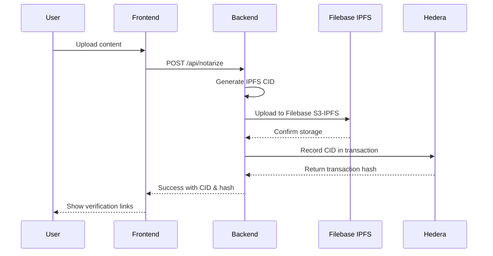
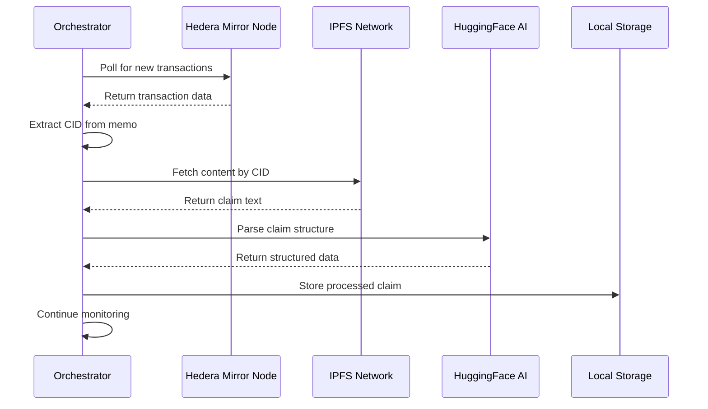

# 🚀 Hedera Content Notarization Platform v2.0

A comprehensive decentralized content notarization system that combines **IPFS storage**, **Hedera blockchain** timestamping, and **AI-powered claim verification** to create legally-admissible proof of content ownership and existence.


## 🌟 What's New in v2.0

- 🏗️ **Monorepo Architecture**: Clean workspace-based structure with `apps/` and `packages/`
- 🤖 **Advanced AI Orchestrators**: Multiple AI agents for real-time claim processing
- 🔧 **Unified Configuration**: Centralized environment management with validation
- 🧪 **Comprehensive Health Checks**: System-wide diagnostics and monitoring
- 📱 **Modern Frontend**: React 19 + TypeScript + Material-UI + TailwindCSS
- 🔄 **Real-time Processing**: Live monitoring of Hedera Mirror Node
- 📊 **Enhanced API**: RESTful backend with proper error handling and CORS
- 🛡️ **Security-First**: Proper secret management and environment validation

## 📁 Repository Structure

```
Hedera_Test/
├── 📁 apps/                      # Application layer
│   ├── frontend/                 # React + TypeScript frontend
│   │   ├── src/
│   │   │   ├── components/       # UI components (NotarizationForm, UI kit)
│   │   │   ├── services/         # API service layer
│   │   │   └── lib/             # Utility functions
│   │   ├── vite.config.ts       # Vite configuration
│   │   └── tailwind.config.js   # TailwindCSS config
│   │
│   └── backend/                 # Express.js API server
│       ├── src/
│       │   └── server.js        # Main server with all endpoints
│       ├── config/              # Backend-specific configuration
│       └── package.json         # Backend dependencies
│
├── 📁 packages/                 # Shared packages
│   ├── agents/                  # AI Agent System
│   │   ├── orchestrators/       # Main processing engines
│   │   │   ├── main-orchestrator.js      # Production orchestrator
│   │   │   ├── demo-orchestrator.js      # Demo/testing orchestrator  
│   │   │   └── legacy-orchestrator.js    # Legacy compatibility
│   │   ├── parsers/             # Claim parsing agents
│   │   │   └── claim-parser.js  # HuggingFace integration
│   │   └── core/                # Core agent functionality
│   │       ├── test-phase2.js   # Phase 2 testing
│   │       └── fluence-config.js # Future Fluence integration
│   │
│   ├── config/                  # Configuration management
│   │   └── env/
│   │       ├── config.js        # Unified config loader & validator
│   │       └── template.env     # Environment template
│   │
│   └── shared/                  # Shared utilities
│       └── types/
│           └── index.ts         # TypeScript definitions
│
├── 📁 tests/                    # Testing suite
│   └── e2e/
│       └── complete-flow-test.js # End-to-end integration tests
│
├── 📁 scripts/                  # Development utilities
│   └── dev/
│       └── health-check.js      # Comprehensive system health checker
│
├── 📄 IPFS_SETUP.md             # IPFS configuration guide
├── 📄 QUICK_START_TESTING.md    # Quick testing instructions
└── 📄 package.json              # Root workspace configuration
```

## ⚡ **TL;DR - Start Server in 30 Seconds**

```bash
# 1. Navigate to project directory
cd /Users/prajwal.m/Hedera_Test

# 2. Install dependencies (first time only)
npm install

# 3. Copy environment template
cp packages/config/env/template.env apps/backend/config/.env

# 4. Edit your credentials in apps/backend/config/.env
# (Add your Hedera account ID, private key, and Filebase credentials)

# 5. Start both frontend and backend
npm run dev

# 6. Open browser to http://localhost:5173
```

**🎉 Done! Backend on port 3001, Frontend on port 5173**

---

## 🚀 Detailed Setup Guide

### Prerequisites

- **Node.js 18+** - [Download here](https://nodejs.org/)
- **HashPack Wallet** - [Install extension](https://hashpack.app/)
- **Filebase Account** - [Sign up](https://console.filebase.com/) for IPFS storage
- **Hedera Testnet Account** - Get test HBAR from [faucet](https://portal.hedera.com/faucet)

### 1. Installation

```bash
# Clone the repository
git clone https://github.com/Sachidananda-17/Hedera_Test.git
cd Hedera_Test

# Install all dependencies (uses workspaces)
npm run setup

# Alternative manual installation
npm install
cd apps/frontend && npm install
cd ../backend && npm install
```

### 2. Configuration

```bash
# Copy environment template to backend config
copy packages\config\env\template.env apps\backend\config\.env

# Edit apps/backend/config/.env with your credentials:
# Required:
HEDERA_ACCOUNT_ID=0.0.your_account_id
HEDERA_PRIVATE_KEY=your_private_key_here
FILEBASE_ACCESS_KEY_ID=your_filebase_access_key
FILEBASE_SECRET_ACCESS_KEY=your_filebase_secret_key
FILEBASE_BUCKET_NAME=your_bucket_name

# Optional (for Phase 2 AI features):
HUGGINGFACE_API_KEY=hf_your_api_key_here
```

### 3. Health Check

```bash
# Verify your complete system setup
npm run health
```

This comprehensive check validates:
- ✅ Configuration files and credentials
- ✅ Backend service connectivity  
- ✅ Phase 2 AI system status
- ✅ External dependencies (Hedera, IPFS, HuggingFace)
- ✅ Network connectivity and permissions

### 4. Start the Platform

#### 🚀 **Quick Start (Recommended)**

```bash
# FROM PROJECT ROOT DIRECTORY (/Users/prajwal.m/Hedera_Test)
# This starts both frontend and backend simultaneously
npm run dev
```
**✅ This single command runs both services concurrently!**

#### 📊 **Individual Service Startup**

If you prefer to run services separately:

```bash
# Terminal 1: Start Backend (from project root)
npm run dev:backend

# Terminal 2: Start Frontend (from project root)  
npm run dev:frontend
```

#### 🔧 **Manual Backend Startup (Alternative)**

```bash
# If you need to start just the backend manually
cd apps/backend
npm install  # Ensure dependencies are installed
npm run dev  # This runs: nodemon src/server.js
```

#### ⚠️ **Important Notes:**
- **Always run commands from the PROJECT ROOT** unless specified otherwise
- **Backend runs on port 3001**, Frontend on port 5173
- **Both services must be running** for full functionality
- **Wait for backend startup** before using the frontend

### 5. Verify Services Are Running

#### ✅ **Check Backend Status**
```bash
# Test backend health
curl http://localhost:3001/api/health

# Should return: {"success": true, "message": "Server is running", ...}
```

#### ✅ **Check Frontend Access**
- Open browser to **http://localhost:5173**
- You should see the "Hedera Notary" interface

### 6. Access the Application

- **🎨 Frontend UI**: http://localhost:5173
- **🔧 Backend API**: http://localhost:3001
- **🏥 Health Check**: http://localhost:3001/api/health
- **🤖 Phase 2 AI Status**: http://localhost:3001/api/phase2/status
- **🧪 Test Filebase**: http://localhost:3001/api/test-filebase

### 7. Verify Everything Works

#### ✅ **Step-by-Step Verification**

1. **Check Backend is Running:**
   ```bash
   curl http://localhost:3001/api/health
   # Should return: {"success": true, "message": "Server is running", ...}
   ```

2. **Check Frontend Loads:**
   - Open http://localhost:5173
   - You should see: "Hedera Notary" interface with upload area

3. **Test Complete Notarization Flow:**
   ```bash
   # Quick API test
   curl -X POST http://localhost:3001/api/notarize \
     -F "accountId=0.0.6752951" \
     -F "contentType=text" \
     -F "text=Hello World Test"
   
   # Should return success with IPFS CID and Hedera transaction hash
   ```

4. **Expected Console Output on Startup:**
   ```
   🚀 HEDERA CONTENT NOTARIZATION PLATFORM
   📡 Server running on: http://localhost:3001
   🔗 IPFS integration: ✅ Ready
   ⚡ Hedera network: testnet (Connected)
   🤖 Phase 2 AI: Available
   ```

#### 🚨 **If Something Doesn't Work:**
1. Check the [Troubleshooting Section](#-troubleshooting) below
2. Run `npm run health` for complete diagnostics
3. Ensure all environment variables are set in `apps/backend/config/.env`

## 🎯 How It Works

### Phase 1: Content Notarization Flow



### Phase 2: AI Claim Processing Flow



## 📊 Available Scripts

### 🚀 **Most Used Commands**

```bash
# Primary development commands (run from project root)
npm run dev               # 🎯 Start both frontend and backend
npm run health            # 🏥 Check complete system status
npm run dev:backend       # 🔧 Start backend only (port 3001)
npm run dev:frontend      # 🎨 Start frontend only (port 5173)
npm run setup             # 📦 Install all dependencies
```

### 🔧 **Development & Deployment**

```bash
# Development
npm run dev                 # Start both frontend and backend
npm run dev:backend        # Start backend only
npm run dev:frontend       # Start frontend only  
npm run start             # Production backend
npm run start:frontend    # Production frontend preview

# Building
npm run build             # Build both applications
npm run build:frontend    # Build React app for production
npm run build:backend     # Backend build (Node.js, no build needed)
```

### Testing & Health

```bash
# Comprehensive system testing
npm run test              # Full end-to-end test suite
npm run test:e2e          # End-to-end integration tests
npm run test:agents       # Test AI agent functionality
npm run health            # Complete system health check
```

### Phase 2 AI Operations

```bash
# AI Orchestrator operations
npm run phase2:start      # Start production orchestrator
npm run phase2:demo       # Run demo orchestrator
npm run phase2:test       # Test AI claim parsing functionality
```

### Maintenance & Development

```bash
# Setup and cleanup
npm run setup             # Install all workspace dependencies
npm run clean             # Remove all node_modules and build files
npm run clean:deps        # Remove dependencies only
npm run clean:build       # Remove build artifacts only

# Code quality
npm run lint              # Run all linters
npm run lint:frontend     # Frontend ESLint
npm run format            # Prettier code formatting
```

## 🔧 Configuration

### Required Environment Variables

The system uses a unified configuration system. All settings go in `apps/backend/config/.env`:

```bash
# Hedera Blockchain Configuration
HEDERA_ACCOUNT_ID=0.0.your_account_id
HEDERA_PRIVATE_KEY=your_private_key_here
HEDERA_NETWORK=testnet

# IPFS Storage via Filebase
FILEBASE_ACCESS_KEY_ID=your_filebase_access_key
FILEBASE_SECRET_ACCESS_KEY=your_filebase_secret_key
FILEBASE_BUCKET_NAME=your_bucket_name
FILEBASE_REGION=us-east-1

# Server Configuration
PORT=3001
CORS_ORIGIN=http://localhost:5173
NODE_ENV=development
```

### Phase 2 AI Configuration (Optional)

```bash
# HuggingFace AI Integration
HUGGINGFACE_API_KEY=hf_your_api_key_here

# Phase 2 Feature Toggles
ENABLE_SEMANTIC_ANALYSIS=true
ENABLE_ADVANCED_PARSING=true
AUTO_EVIDENCE_PREPARATION=true
AUTO_START_PHASE2=false

# Agent Configuration
AGENT_POLL_INTERVAL=10000
MOCK_IPFS_ON_FAILURE=false
```

### Advanced Configuration

```bash
# Logging Configuration
LOG_LEVEL=INFO
ENABLE_DETAILED_LOGS=true

# Testing Configuration
TEST_MODE=false
MOCK_EXTERNAL_SERVICES=false
REAL_TIME_PROCESSING=true

# Future Features (Experimental)
FETCH_PRIVATE_KEY=your_fetch_ai_private_key_here
FLUENCE_NETWORK=testnet
```

See `packages/config/env/template.env` for complete configuration options and detailed documentation.

## 🧪 Testing

### System Health Check

```bash
npm run health
```

The health checker performs comprehensive diagnostics:

- **Configuration Validation**: Checks all required environment variables
- **Service Connectivity**: Tests backend API endpoints
- **Phase 2 AI Status**: Verifies orchestrator functionality  
- **External Dependencies**: Tests Hedera, IPFS, and HuggingFace connectivity
- **Network & Permissions**: Validates file system and network access
- **Database Status**: Checks processed claims storage

### End-to-End Testing

```bash
npm run test:e2e
```

Complete integration test flow:
1. **Service Startup**: Automatically starts backend and frontend
2. **Content Upload**: Tests file upload and notarization
3. **IPFS Verification**: Confirms content is accessible via IPFS
4. **Hedera Verification**: Validates blockchain transaction
5. **Phase 2 Testing**: Tests AI claim processing (if enabled)
6. **Gateway Testing**: Verifies multiple IPFS gateway access
7. **Cleanup**: Stops test services and cleans up

### AI Agent Testing

```bash
npm run test:agents
```

Tests Phase 2 AI functionality:
- HuggingFace API connectivity
- Claim parsing accuracy
- Orchestrator processing logic
- Error handling and recovery

## 🔍 API Documentation

### Core Endpoints

| Method | Endpoint | Description | Request | Response |
|--------|----------|-------------|---------|----------|
| `POST` | `/api/notarize` | Submit content for notarization | File upload or text | CID, transaction hash, IPFS links |
| `GET` | `/api/health` | System health status | - | System status report |
| `GET` | `/api/ipfs/:cid` | Get IPFS gateway URLs | CID parameter | Multiple gateway URLs |

### Phase 2 AI Endpoints

| Method | Endpoint | Description | Request | Response |
|--------|----------|-------------|---------|----------|
| `GET` | `/api/phase2/status` | Orchestrator status | - | Running status, processed claims count |
| `POST` | `/api/phase2/start` | Start real-time processing | - | Success/error message |
| `POST` | `/api/phase2/stop` | Stop processing | - | Success/error message |
| `GET` | `/api/phase2/claims` | List processed claims | - | Array of processed claims |
| `GET` | `/api/phase2/claims/:cid` | Get specific claim data | CID parameter | Detailed claim information |

### Request/Response Examples

**Notarize Content:**
```bash
curl -X POST http://localhost:3001/api/notarize \
  -F "content=@document.pdf" \
  -F "description=Legal contract v1.0"
```

**Response:**
```json
{
  "success": true,
  "cid": "bafybeig...",
  "hederaTxHash": "0.0.123456@1234567890.123456789",
  "ipfsUrls": [
    "https://ipfs.filebase.io/ipfs/bafybeig...",
    "https://gateway.pinata.cloud/ipfs/bafybeig...",
    "https://dweb.link/ipfs/bafybeig..."
  ],
  "timestamp": "2024-01-15T10:30:00Z"
}
```

## 🛡️ Production Deployment

### Environment Setup

1. **Production Environment Variables**:
   ```bash
   NODE_ENV=production
   PORT=3001
   AUTO_START_PHASE2=true
   LOG_LEVEL=WARN
   ENABLE_DETAILED_LOGS=false
   ```

2. **Build and Deploy**:
   ```bash
   # Build frontend
   npm run build:frontend
   
   # Start production server
   npm run start
   ```

3. **Process Management** (recommended):
   ```bash
   # Using PM2
   pm2 start "npm run start" --name hedera-notary
   pm2 startup
   pm2 save
   ```

### Security Considerations

- **Environment Variables**: Store sensitive data in environment variables, never in code
- **HTTPS**: Enable SSL/TLS in production environments
- **CORS**: Configure proper CORS origins for production domains
- **Rate Limiting**: Implement rate limiting on API endpoints
- **Monitoring**: Enable logging and monitoring for security events
- **Backup**: Regular backup of processed claims and configuration
- **Updates**: Keep dependencies updated and monitor for security advisories

### Monitoring & Maintenance

```bash
# Check system health in production
curl http://your-domain:3001/api/health

# Monitor Phase 2 processing
curl http://your-domain:3001/api/phase2/status

# View logs
tail -f logs/application.log

# Restart services
pm2 restart hedera-notary
```

## 🆘 Troubleshooting

### 🚨 **Server Startup Issues**

**Problem: `nodemon: command not found`**
```bash
# Solution: Install dependencies from project root
cd /Users/prajwal.m/Hedera_Test
npm install

# Then install backend dependencies
cd apps/backend
npm install

# Go back to root and try again
cd ../..
npm run dev
```

**Problem: `Missing script: "start"`**
```bash
# Solution: Always run commands from PROJECT ROOT
pwd  # Should show: /Users/prajwal.m/Hedera_Test
npm run dev  # ✅ Correct
```

**Problem: `Cannot find module '/Users/prajwal.m/Hedera_Test/apps/backend/server.js'`**
```bash
# Solution: The server file is in src/ subdirectory
# This should be automatically handled by package.json scripts
# If issue persists, manually check:
ls apps/backend/src/server.js  # Should exist
```

**Problem: `EADDRINUSE: address already in use :::3001`**
```bash
# Solution: Kill existing process
pkill -f "node.*server.js"
# OR find and kill specific process
lsof -ti:3001 | xargs kill -9
# Then restart
npm run dev
```

**Problem: `SyntaxError` in server.js**
```bash
# Solution: Check for incomplete code edits
# Restart the server after any code changes
npm run dev:backend
```

### 🔧 **Configuration Issues**

**1. Configuration Errors**
```bash
# Run health check to diagnose
npm run health

# Check specific configuration
node -e "console.log(require('./packages/config/env/config.js').config)"
```

**2. Backend Connection Issues**
```bash
# Check if backend is running
curl http://localhost:3001/api/health

# If connection refused, backend isn't running:
npm run dev:backend

# Check backend logs for errors
cd apps/backend && npm run dev
```

**3. Environment Variables Not Loading**
```bash
# Ensure .env file exists in correct location
ls apps/backend/config/.env

# If missing, copy template:
cp packages/config/env/template.env apps/backend/config/.env
# Then edit with your credentials
```

### 🌐 **IPFS & Network Issues**

**4. IPFS Upload Failures**
```bash
# Test Filebase connectivity
curl http://localhost:3001/api/test-filebase

# Common solutions:
# - Verify Filebase credentials in apps/backend/config/.env
# - Check bucket name and region settings
# - Corporate firewall may block Filebase (expected behavior)
```

**5. Corporate Network Issues**
```bash
# If behind corporate firewall (like Zscaler):
# This is EXPECTED and handled gracefully
# The system will generate local IPFS CIDs
# Content may not be available on public IPFS network

# Check if local CID generation works:
curl -X POST http://localhost:3001/api/notarize \
  -F "accountId=0.0.6752951" \
  -F "contentType=text" \
  -F "text=test"
```

### 🤖 **AI & Phase 2 Issues**

**6. Phase 2 AI Not Working**
```bash
# Test AI functionality
npm run phase2:test

# Check HuggingFace API key
curl -H "Authorization: Bearer YOUR_API_KEY" https://api-inference.huggingface.co/models/gpt2

# Check orchestrator status
curl http://localhost:3001/api/phase2/status
```

### 🖥️ **Frontend Issues**

**7. Frontend Connection Issues**
```bash
# Ensure backend is running first
curl http://localhost:3001/api/health

# Start frontend (from project root)
npm run dev:frontend

# Common solutions:
# - Clear browser cache
# - Check browser console for errors
# - Verify CORS settings in backend .env
# - Ensure HashPack wallet is installed
```

**8. Logo Not Displaying**
```bash
# Check logo file location
ls apps/frontend/public/Logo.png

# If missing, move logo to correct location:
mv Logo.png apps/frontend/public/
```

### ⚡ **Quick Fixes**

**9. "Everything is broken" - Nuclear Option**
```bash
# Complete reset (from project root)
npm run clean        # Remove all node_modules
npm run setup        # Reinstall everything
npm run health       # Verify configuration
npm run dev          # Start services
```

**10. Still Having Issues?**
```bash
# Get detailed system information
npm run health       # Shows complete system status
node --version       # Should be 18+
npm --version        # Should be recent

# Check all services individually
curl http://localhost:3001/api/health     # Backend
curl http://localhost:5173               # Frontend  
curl http://localhost:3001/api/test-filebase  # IPFS
```

### Debug Mode

Enable comprehensive debugging:
```bash
# In apps/backend/config/.env
LOG_LEVEL=DEBUG
ENABLE_DETAILED_LOGS=true
TEST_MODE=true
MOCK_EXTERNAL_SERVICES=false
```

### Getting Help

1. **Check Documentation**: Review `IPFS_SETUP.md` and `QUICK_START_TESTING.md`
2. **Run Diagnostics**: Always start with `npm run health`
3. **Check Logs**: Enable debug logging for detailed error information
4. **Test Components**: Use individual test commands to isolate issues
5. **GitHub Issues**: Report bugs with full error logs and system information

## 🤝 Contributing

1. Fork the repository
2. Create a feature branch: `git checkout -b feature/amazing-feature`
3. Install dependencies: `npm run setup`
4. Run tests: `npm test`
5. Make your changes and test thoroughly
6. Run health check: `npm run health`
7. Commit changes: `git commit -m 'Add amazing feature'`
8. Push to branch: `git push origin feature/amazing-feature`
9. Submit a pull request

### Development Guidelines

- **Code Style**: Use Prettier for formatting (`npm run format`)
- **Linting**: Fix all ESLint issues (`npm run lint`)
- **Testing**: Ensure all tests pass (`npm test`)
- **Documentation**: Update README and inline documentation
- **Configuration**: Follow unified config patterns in `packages/config/`

## 📄 License

This project is licensed under the ISC License - see the [LICENSE](LICENSE) file for details.

## 🙏 Acknowledgments

- [Hedera Hashgraph](https://hedera.com/) for blockchain infrastructure
- [Filebase](https://filebase.com/) for IPFS storage and S3 compatibility
- [HuggingFace](https://huggingface.co/) for AI models and inference API
- [HashPack](https://hashpack.app/) for seamless wallet integration
- [Material-UI](https://mui.com/) for React component library
- [Vite](https://vitejs.dev/) for fast frontend development

---

## 🎉 **Ready to Create Unbreakable Digital Proof!** 🛡️

**Your content. Your timestamp. Your proof. Forever on the blockchain.**

### Quick Links
- 📖 [IPFS Setup Guide](IPFS_SETUP.md)
- 🚀 [Quick Start Testing](QUICK_START_TESTING.md)
- 🔧 [Configuration Template](packages/config/env/template.env)
- 🏥 Health Check: `npm run health`
- 🧪 Full Test Suite: `npm test`

*Built with ❤️ using Hedera, IPFS, and AI*
